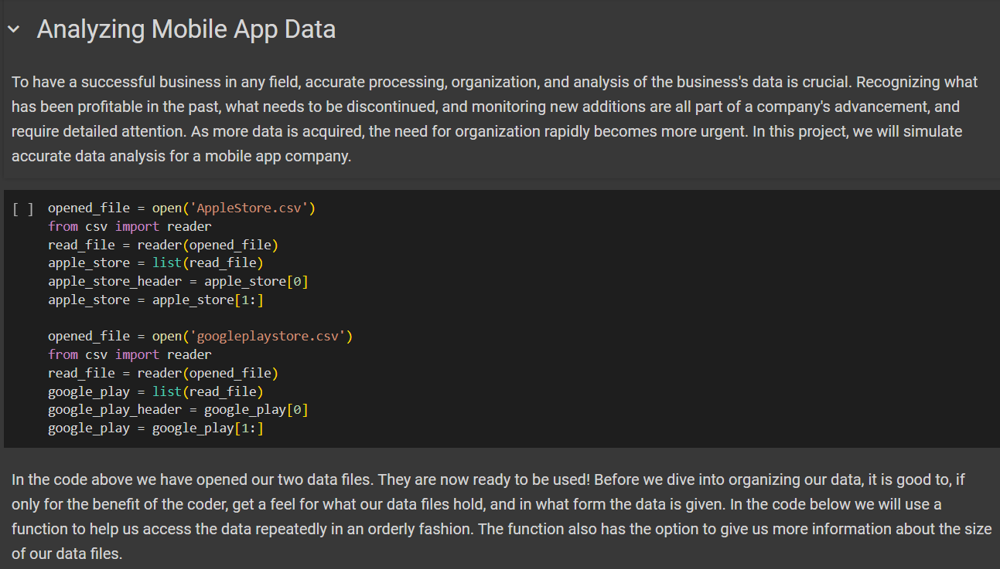

# Analyzing Mobile App Data
In this project, we will look at two datasets that contain information about many different apps. First, We will clean the datasets. Then we will analyze them, looking for the most common app genre, apps with high ratings, and apps with the most installs. Based on our findings, we will create a suggested app profile that is likely to be profitable.

View this project live on Google Colab [here](https://colab.research.google.com/drive/1ffd76XS6OXXMzFtPq3_qxmaNDB4pxCaW?usp=sharing).
